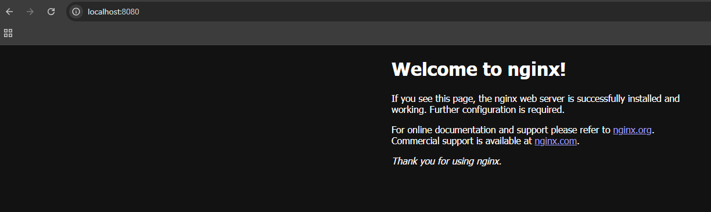
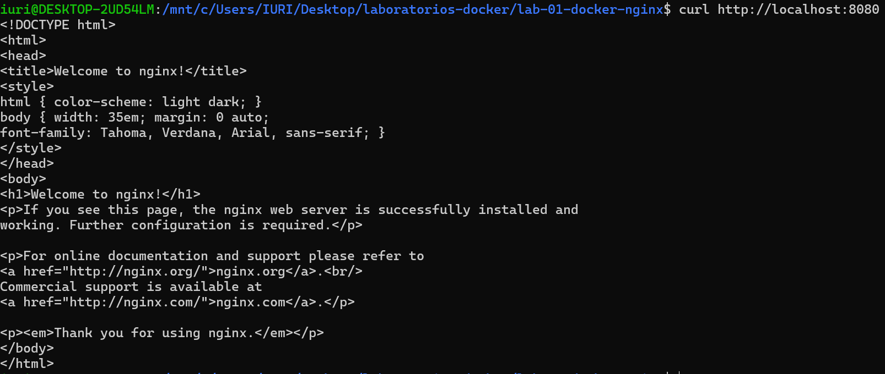

# Lab 01 – Docker básico com Nginx

Este lab demonstra como usar comandos básicos do Docker para rodar um container com o Nginx.

## Passos

1. Baixar a imagem:
- docker pull nginx

2. Rodar o container:
- docker run -d --name webserver -p 8080:80 nginx

3. Verificar se está rodando:
- docker ps

4. Testar via navegador ou curl:
- curl http://localhost:8080

5. Acessar o container:
- docker exec -it webserver bash

6. Parar e remover:
- docker stop webserver
- docker rm webserver

7. (Opcional) Remover imagem:
- docker rmi nginx

## Conceitos aplicados

- docker pull, docker run, docker ps, docker exec
- Modo "detached" com -d
- Mapeamento de porta com -p

## Imagens

